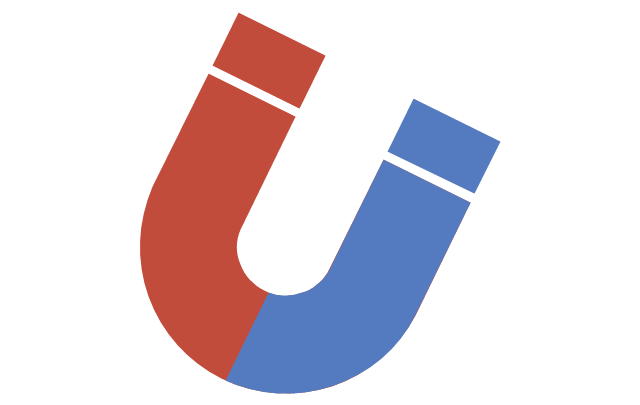

<div align="center">

</div>
<div align="left">


</div>

# constrainter


A handy tool to constraint UIViews

Constrainter (Constrainer) is a very lightweight constraining tool (inspired by [CosmicMind Material](https://github.com/CosmicMind/Material) layouting syntax)
which supports constraining a view to its super and to another view with a very easy syntax. 
and also you can add your own custom constraint outside the box and keep its reference.


# How to start
Add this line in your podfile
 
 ```swift
 pod 'Constrainter'
 ```

## How to use

import Constrainter to your class and use follow instructions.

```swift
import Constrainter
```

# Constraint to all edges
  
  ```swift
  parentView.addSubview(view)
  view.beginConstraints()
        .edges()
        .endConstraints()
 ```

# Constraint to center/centerVertically/centerHorizontally

```swift
  parentView.addSubview(view)
  view.beginConstraints()
        .center()
        .endConstraints()
 ```

 ```swift
  parentView.addSubview(view)
  view.beginConstraints()
        .center()
     .endConstraints()
 ```
 
 
 ```swift
  view.beginConstraints()
        .centerVertically()
        .endConstraints()
 ```
 or
 
  ```swift
  view.beginConstraints()
        .centerVertically(-10)
        .endConstraints()
 ```
 or
 
  ```swift
  view.beginConstraints()
        .centerVertically(10)
        .endConstraints()
 ```
 
 ```swift
  view.beginConstraints()
        .centerHorizontally()
        .endConstraints()
 ```
 
 In above samples, Constrainter sets constarint to superview but you can define where to centerHorizontally/centerVertically.
 
 # Constraint to right/left/top/bottom and height/width
 
 ```swift
 
//adding views
let blueButton = UIButton()
let greenButton = UIButton()
parentView.addSubview(blueButton)
parentView.addSubview(greenButton)


//setting greenButton at center of its superview
greenButton.beginConstraints()
  .center()
  .height(100)
  .width(100)
  .endConstraints()
 ```
 
and now set blueButton at left side of greenButton:

```swift
 blueButton.beginConstraints()
   .right(10, to: .left, of: greenButton)
   .height(100)
   .width(100)
   .centerVertically()
   .endConstraints()
```
**Note**: This " to: of: " format can be used with left/right/top/bottom/centerHorizontally/centerVertically operators.

# Adding custom constraints and keeping its reference

```swift
let referencedConst = NSLayoutConstraint()//set what you want and keep its reference for later use.
blueButton.beginConstraints()
   .right(10, to: .left, of: greenButton)
   .height(100)
   .width(100)
   .centerVertically()
   .customConstraint(referencedConst)
   .endConstraints()
```
 
  
